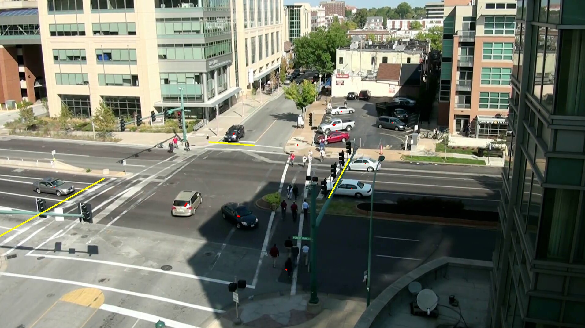
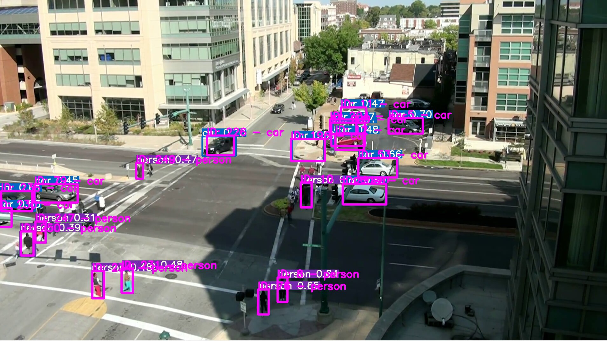

# Vehicle Counter

## Overview

This program uses object detection: [YOLOv5 by ultralytics](https://github.com/ultralytics/yolov5) for vehicle detection and localization, and object tracking: [Deep Sort with PyTorch](https://github.com/ZQPei/deep_sort_pytorch), PyTorch implementation from original [Deep SORT](https://github.com/nwojke/deep_sort). Detection of vehicles crossing the imaginary line using matrix calculation. All events will be stored to the database in realtime using API. ([Demo Video](https://www.youtube.com/watch?v=Od44wTbGYJk))
 

## Requirements
To install all the necessary requirements, run:

``` bash
$ pip3 install --upgrade pip
$ pip3 install -r requirements.txt
```
List of requirements:
``` bash
Cython
matplotlib>=3.2.2
numpy>=1.18.5
opencv-python>=4.1.2
pillow
PyYAML>=5.3
scipy>=1.4.1
tensorboard>=2.2
torch>=1.6.0
torchvision>=0.7.0
tqdm>=4.41.0
easydict >= 1.9
filterpy >= 1.4.5
scikit-image >= 0.17.2
mysql-connector-python >= 8.0.22
```
Make sure PyTorch can run on CUDA

### (optional)
Download Deep SORT model (ckpt.t7) from [here](https://drive.google.com/drive/folders/1xhG0kRH1EX5B9_Iz8gQJb7UNnn_riXi6) to this folder:
```
vehicle_counter/deep_sort/deep_sort/deep/checkpoint/
```

## PyTorch on CUDA
To check if the PyTorch is running on CUDA, run:

``` bash
$ python3 cuda_check.py
```
The expected output is similar as below:
``` bash
Torch CUDA Current Device: 0
Torch CUDA Device: <torch.cuda.device object at 0x7ff2923a38d0>
Torch CUDA Device Count: 1
Torch CUDA Device Name: GeForce GTX 1080
Torch CUDA Availability: True
```
If CUDA Availability is False, then reinstall CUDA drivers and check the driver support version.

## How to Run Traffic Counter
To run the traffic counter:
``` bash
$ python3 detect4.py --source /path/to/video/or/stream.ext --view-img
```
Change `/path/to/video/or/stream.ext` to desired video or stream. (For demo, try [demo_videos/8.mp4](demo_videos/8.mp4))

For detailed arguments, run:
``` bash
$ python3 detect4.py --help
```
This program can perform vehicle counter in realtime, as well as detect vehicle crossing the defined imaginary line.

To define imaginary line, edit line 64 in [detect4.py](detect4.py):
``` python
map2d.setLine((x1, y1), (x2, y2)
```
You can add or remove line by inserting or editing the two points representing the imaginary line. If you didn't know the point coordinates of the line, then run:
``` bash
$ python3 point_capture.py --source /path/to/video/or/stream.ext
```
Change `/path/to/video/or/stream.ext` to desired video or stream.

Please refer to the inline documentation on [point_capture.py](point_capture.py) (quoted below) for the instructions.

> How to use (video source):
> 1. Run 'python point_capture.py --source /video/path.ext' (--rescale if needed)
> 2. Hit SPACEBAR to pause or resume the video
> 3. Left click when the video pauses to mark the reference point
> 4. Right click to remove the reference point
> 5. Press ESC to exit the program

To store all crossing events to the database with API via http post, edit line 10 in [two_dim_map.py](two_dim_map.py):
``` python
do_post_http = False  # True: post every crossing event in json format to http_address
http_address = 'ipaddress:port/path/api/url'  # http post address
```
Set `do_post_http` True and change `http_address` to desired http post address. 

HTTP post contains:
``` python
headers = {'Content-Type': 'application/json'}
body = {'timestamps': float(timestamp),
        'imaginary_line': int(imaginary_line_number),
        'object_id': int(vehicle_id),
        'object_class': int(type_of_vehicle)}                        
```
